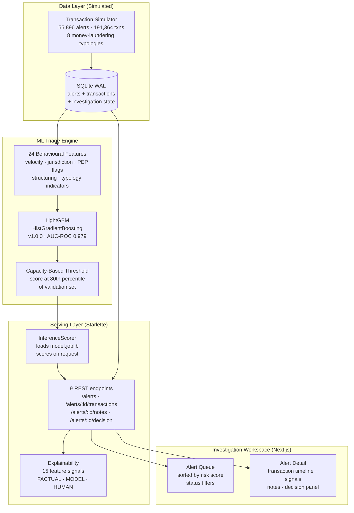
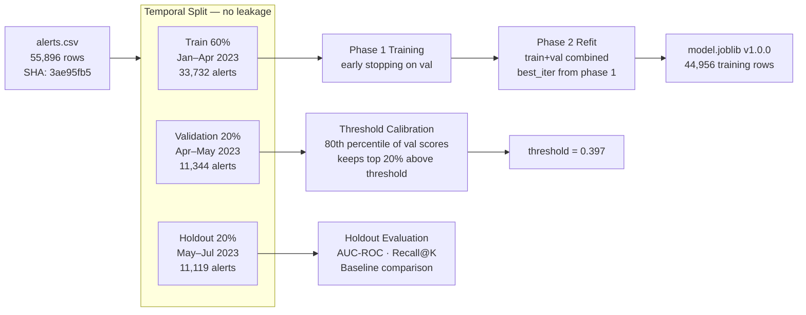
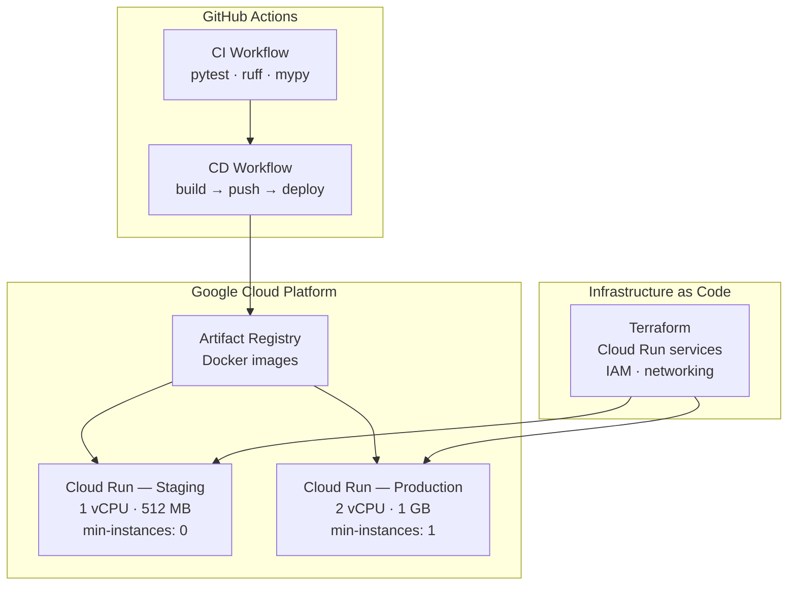
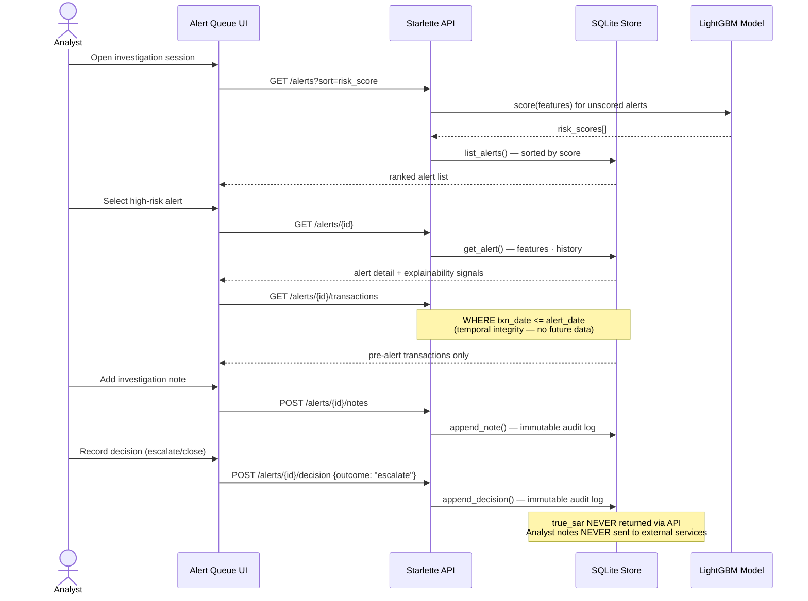

# AlertIQ

**AML Alert Triage Engine — adaptive prioritisation for financial crime investigation**

[](https://github.com/rithwikm7/alertiq/actions/workflows/ci.yml)
[](https://www.python.org/)
[](LICENSE)

---

## What is AlertIQ?

Banks generate thousands of Anti-Money Laundering (AML) alerts daily. Investigators can realistically review only a fraction of them — typically 15–25% of the queue. Every unreviewed alert above that threshold is ignored by default, regardless of actual risk.

AlertIQ is a triage engine that **ranks alerts by estimated SAR probability** so that investigators working through a sorted queue catch the most suspicious activity within their capacity limit. It also provides a full **investigation workspace** — transaction history, risk explainability signals, note-taking, and audit-logged decisions.

> **Data disclosure:** AlertIQ was built on a purpose-built transaction simulator with 55,896 alerts and 191,364 transactions across 3,000 simulated accounts. All data is synthetic. Performance figures are from held-out test data and are not comparable to production AML system benchmarks.

---

## The Problem

| Without triage | With AlertIQ |
|---|---|
| Investigators review alerts in arbitrary order | Investigators work a ranked queue — highest-risk first |
| A 20% capacity limit means 80% of alerts are missed uniformly | A 20% capacity limit reviewed the top-ranked 20% — catching **100% of true SARs** on held-out data (simulated) |
| No systematic evidence trail per alert | Append-only notes, decisions, and explainability signals per alert |

---

## Architecture

### System Overview



### ML Training Lifecycle



### Deployment Architecture



### Analyst Investigation Workflow



---

## Performance Results

> All figures are from held-out test data (11,119 alerts, never seen during training). Data is fully simulated — see [Data Disclosure](#data-disclosure) above.

### Capacity-Ranking Mode (Primary Operating Policy)

Analysts work through the sorted queue and stop at their capacity limit. The key metric is: **what fraction of real SARs are caught before the analyst's stop point?**

| Capacity | Random baseline | Severity baseline | AlertIQ ML | Lift vs. random |
|---|---|---|---|---|
| Review top 10% | 9.9% of SARs caught | 25.8% of SARs caught | **71.8% of SARs caught** | 7.2× |
| Review top 20% | 20.2% of SARs caught | 34.8% of SARs caught | **100.0% of SARs caught** | 4.9× |
| Review top 30% | 30.9% of SARs caught | 41.2% of SARs caught | **100.0% of SARs caught** | 3.2× |

### Classification Mode (Diagnostic)

| Metric | Value |
|---|---|
| AUC-ROC | **0.979** |
| AUC-PR | **0.774** |
| F1 (at capacity threshold) | **0.810** |
| Precision | 0.663 |
| Recall | 0.999 |

### Walk-Forward Stability (3 expanding windows, Jan–Jun 2023)

| Metric | Mean | Min | Max | Std |
|---|---|---|---|---|
| AUC-ROC | 0.980 | 0.978 | 0.981 | 0.002 |
| Recall@20% | 1.000 | 1.000 | 1.000 | 0.000 |
| F1 | 0.803 | 0.797 | 0.809 | 0.005 |

The model is stable across the three training windows evaluated.

### Baseline Comparison

| Scorer | AUC-ROC | Recall@20% |
|---|---|---|
| Random | 0.509 | 20.2% |
| Severity-only | 0.564 | 34.8% |
| **AlertIQ ML** | **0.979** | **100.0%** |

---

## Features

### Triage Engine (ML)
- **24 behavioural features** engineered from transaction history: velocity ratios, jurisdiction entropy, structuring indicators, PEP flags, adverse media flags, cash intensity, round-number clustering, cross-border concentration
- **Leakage-safe temporal splits**: training data is strictly ordered; holdout alerts are never seen during training or threshold calibration
- **Capacity-based threshold**: threshold set at the 80th percentile of validation scores — keeps exactly 20% of the queue above the threshold regardless of score distribution
- **Walk-forward validation**: 3 expanding windows confirming stability across time periods
- **Model registry**: versioned `model.joblib` with SHA-256 verification and `registry.json`
- **PSI monitoring**: Population Stability Index computed per feature to detect score drift

### Investigation Workspace (API + UI)
- **Temporal evidence integrity**: transaction history endpoint enforces `WHERE txn_date <= alert_date` — investigators see only pre-alert evidence, matching real AML compliance requirements
- **Deterministic explainability**: 15 feature signals classified as FACTUAL_EVIDENCE / MODEL_SIGNAL / HUMAN_DECISION — no LLM, no black-box, fully reproducible
- **Immutable audit trail**: notes and decisions are append-only; prior history is never modified
- **`true_sar` suppression**: ground truth label is never returned by any API endpoint — analysts work blind, as in real investigation
- **Alert lifecycle management**: open → in-review → escalated/closed with status transitions

### Engineering
- **InvestigationRepository ABC**: abstract persistence interface designed for production swap-in (PostgreSQL, cloud DB)
- **Structured logging** via Python `logging` throughout serving layer
- **Health and metrics endpoints**: `/health`, `/metrics` for operational monitoring
- **Starlette async API**: lightweight, no framework magic, explicit routing
- **Docker + Cloud Run**: containerised, deployed to Google Cloud Run via Terraform

---

## Quick Start

### Prerequisites

- Python 3.11+
- Node.js 18+ (UI only)

### Backend

```bash
git clone https://github.com/rithwikm7/alertiq.git
cd alertiq

# Create virtual environment
python -m venv .venv
source .venv/bin/activate       # Windows: .venv\Scripts\activate

# Install dependencies
pip install -e ".[dev]"

# Train and register the model (required on first run — models/ is not committed)
python scripts/train_and_serialize.py --version 1.0.0 --promote

# Seed the investigation database with demonstration alerts
python scripts/seed_alert_store.py

# Start the API server
uvicorn alertiq.serving.app:app --reload --port 8000
# Health check: http://localhost:8000/health
```

### Frontend (UI)

```bash
cd ui
npm install
npm run dev
# Open: http://localhost:3000
```

### Run Tests

```bash
# Fast unit + integration tests (no real data required)
pytest

# With coverage
pytest --cov=alertiq --cov-report=term-missing

# Integration tests (requires data/simulation/alerts.csv)
pytest -m integration -v

# Specific test module
pytest tests/serving/test_investigation_journey.py -v
```

### Docker (full stack)

```bash
docker build -t alertiq:local .
docker run -p 8000:8080 -e ALERTIQ_STORE_PATH=/tmp/alertiq.db alertiq:local
```

### Reproduce the ML Results

```bash
# Train the triage model and evaluate against baselines
python scripts/run_triage_experiment.py

# Run robustness experiments (walk-forward, drift, calibration)
python scripts/run_robustness_experiment.py

# Performance benchmark
python scripts/performance_benchmark.py
```

---

## Repository Structure

```
alertiq/
├── src/alertiq/
│   ├── simulation/          # Transaction simulator (8 ML typologies)
│   │   ├── typologies/      # Structuring, layering, shell company, etc.
│   │   └── tms/             # Transaction monitoring system rules
│   ├── triage/              # ML triage engine
│   │   ├── config.py        # Feature columns, split parameters
│   │   ├── dataset.py       # Temporal split, feature matrix builder
│   │   ├── scorer.py        # TriageScorer (HistGBM, phase 1/2 training)
│   │   ├── evaluator.py     # AUC-ROC, Recall@K, classification metrics
│   │   └── baseline.py      # Random and severity-only baselines
│   ├── robustness/          # Monitoring and stability analysis
│   │   ├── drift.py         # PSI-based feature drift detection
│   │   ├── walkforward.py   # Expanding-window walk-forward validation
│   │   ├── calibration.py   # Score calibration analysis
│   │   └── champion.py      # Champion/challenger model comparison
│   └── serving/             # Starlette REST API
│       ├── app.py           # Application factory, lifespan, middleware
│       ├── alert_routes.py  # 9 investigation endpoints
│       ├── alert_store.py   # SQLite persistence + explainability signals
│       └── scorer.py        # Inference scorer (load model, predict)
├── tests/                   # 663 passing tests
│   ├── simulation/          # Simulator unit tests
│   ├── triage/              # ML pipeline unit + integration tests
│   ├── robustness/          # Robustness module tests
│   ├── serving/             # API tests including E2E journey
│   └── operational/         # Failure mode tests
├── ui/                      # Next.js investigation workspace
│   └── src/
│       ├── app/             # Alert queue + detail pages
│       ├── components/      # RiskBadge, StatusBadge, QualityWarning
│       └── lib/             # API client, TypeScript types
├── scripts/                 # Experiment runners + utilities
├── data/
│   ├── simulation/          # alerts.csv, transactions.csv, accounts.csv
│   ├── experiment/          # Baseline comparison results
│   └── robustness/          # Walk-forward, drift, calibration outputs
├── models/
│   ├── 1.0.0/model.joblib   # Trained model artefact
│   └── registry.json        # Model version registry
├── infra/terraform/         # Cloud Run + IAM Terraform
├── deploy/                  # Cloud Run YAML manifests
└── .github/workflows/       # CI (test/lint) + CD (build/deploy) pipelines
```

---

## Technology Stack

| Layer | Technology | Why |
|---|---|---|
| Simulation | Python, NumPy, Pandas | Purpose-built AML typology simulation |
| ML | scikit-learn HistGBM | Handles missing values natively; strong tabular baseline |
| API | Starlette + Uvicorn | Lightweight async; no ORM magic; explicit routing |
| Persistence | SQLite (WAL mode) | Zero-dependency for demo; `InvestigationRepository` ABC enables swap to Postgres |
| Frontend | Next.js 14, TypeScript, Recharts | Type-safe; server components; chart support |
| Container | Docker | Reproducible builds; Cloud Run deployment |
| IaC | Terraform | Declarative Cloud Run + IAM configuration |
| CI/CD | GitHub Actions | Automated test, lint, build, and deploy pipeline |
| Cloud | Google Cloud Run | Serverless; auto-scaling; pay-per-use |

---

## Data Disclosure

AlertIQ uses a **purpose-built transaction simulator**, not real banking data:

- **55,896 alerts** generated across a 6-month window (Jan–Jul 2023)
- **191,364 transactions** across 3,000 simulated accounts
- **8 money-laundering typologies**: structuring, cash-intensive business, professional money laundering, shell company layering, real estate, cross-border, trade-based, virtual assets
- **True SAR rate**: ~9.5% (5,209 of 55,896 alerts are labelled as true SARs)
- Dataset fingerprint: SHA-256 `3ae95fb5` (see [DATA_PROVENANCE.md](docs/DATA_PROVENANCE.md))

Performance figures (AUC-ROC 0.979, Recall@20% 100%) reflect model performance on this synthetic dataset. Results on real AML alert data would differ — typical production AML ML systems achieve AUC-ROC 0.70–0.85 on real alerts with far noisier labels and more severe class imbalance.

---

## Known Limitations

| Limitation | Detail | Production path |
|---|---|---|
| Synthetic data only | No real banking data; performance is artificially high | Real data pipeline + compliance approval |
| SQLite persistence | Single-server, in-process DB; no concurrent writers | `InvestigationRepository` ABC → PostgreSQL swap |
| No authentication | API has no auth layer | JWT/OAuth2 middleware |
| Ephemeral Cloud Run storage | SQLite resets on container restart | Persistent volume or external DB |
| Single analyst | No multi-user session isolation | Per-user DB rows + auth context |
| No rate limiting | API is unprotected | Middleware + API gateway |
| Model drift handling | PSI monitoring exists; no automated retraining trigger | Human-in-the-loop retraining governance |

---

## Documentation

| Document | Description |
|---|---|
| [docs/README.md](docs/README.md) | Documentation index |
| [docs/MODEL_CARD.md](docs/MODEL_CARD.md) | Full model documentation (features, training, evaluation) |
| [docs/MODEL_LINEAGE.md](docs/MODEL_LINEAGE.md) | Model version history and training provenance |
| [docs/DATA_PROVENANCE.md](docs/DATA_PROVENANCE.md) | Dataset fingerprints, version history, derived artefact policy |
| [docs/SERVING_ARCHITECTURE.md](docs/SERVING_ARCHITECTURE.md) | API design, endpoint reference, request/response schemas |
| [docs/PERSISTENCE_ARCHITECTURE.md](docs/PERSISTENCE_ARCHITECTURE.md) | Investigation store design, production upgrade path |
| [docs/MODEL_MONITORING.md](docs/MODEL_MONITORING.md) | Drift detection, PSI monitoring, retraining governance |
| [docs/DEPLOYMENT.md](docs/DEPLOYMENT.md) | Cloud Run deployment, Terraform, CI/CD |
| [docs/DEMO_SCRIPT.md](docs/DEMO_SCRIPT.md) | 3–5 minute structured demonstration |
| [docs/INTERVIEW_GUIDE.md](docs/INTERVIEW_GUIDE.md) | 22+ technical interview Q&A |

---

## What Was Built (M1–M6.1)

| Milestone | Deliverable |
|---|---|
| M1 | Transaction simulator — 3,000 accounts, 8 ML typologies, realistic SAR labelling |
| M2 | Triage engine — 24 features, LightGBM, leakage-safe temporal splits, baseline comparisons |
| M2.1 | Evaluation framework — Recall@K, capacity-based threshold, AUC-ROC vs. AUC-PR distinction |
| M3 | Robustness suite — walk-forward validation, PSI drift, calibration, stress testing |
| M4 | Model registry + serialisation — versioned joblib, SHA-256 verification, champion/challenger |
| M5 | Starlette serving layer — 9 REST endpoints, InferenceScorer, structured logging, health/metrics |
| M5.1 | Next.js investigation workspace — alert queue, detail view, RiskBadge, QualityWarning |
| M6 | SQLite investigation store — notes, decisions, explainability signals, audit trail |
| M6.1 | Temporal evidence integrity — `WHERE txn_date <= alert_date`, `true_sar` suppression, 663/663 tests |

---

## Engineering Decisions Worth Explaining

**Why capacity-based threshold instead of F1-optimal?** F1 optimises a symmetric trade-off between precision and recall. In AML, the cost of a missed SAR vastly exceeds the cost of a false positive (analyst time). Setting the threshold at the 80th percentile of validation scores directly operationalises the "review top 20%" policy without assuming symmetric costs.

**Why temporal splits and not random splits?** Random splits leak future transaction patterns into training data, making the model appear to perform better than it would in production. Temporal splits reflect the actual deployment scenario: the model is trained on historical data and scored on future alerts.

**Why two training phases?** Phase 1 uses early stopping on a held-out validation set to find the optimal number of iterations. Phase 2 refits on train+val combined using that iteration count — this uses all available labelled data for the final model without leaking holdout data.

**Why SQLite and not PostgreSQL?** This is a portfolio project with a Cloud Run deployment. SQLite with WAL mode handles concurrent reads adequately for a demo. The `InvestigationRepository` ABC interface means the persistence layer can be swapped without changing any route handlers.

**Why Starlette and not FastAPI?** Starlette is what FastAPI is built on. Using it directly demonstrates understanding of ASGI middleware, lifespan events, and routing at a lower abstraction level.

---

## License

[MIT](LICENSE)

---

## Author

Built by Rithwik Maramraju as part of the ApexForge Labs portfolio project series.
